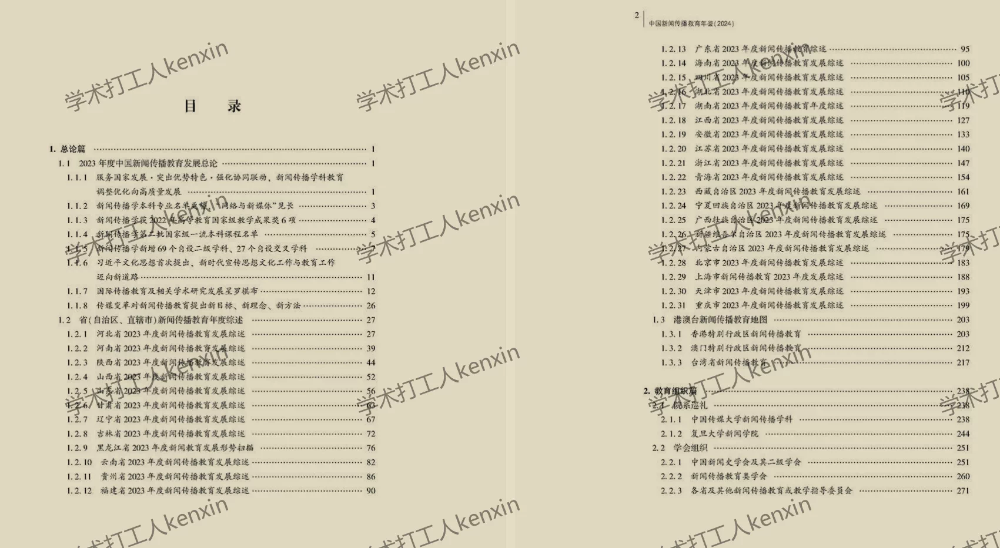
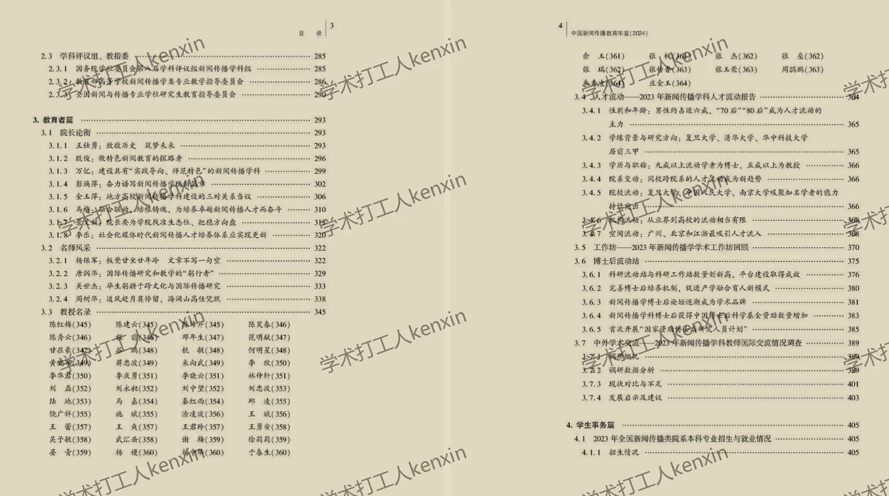
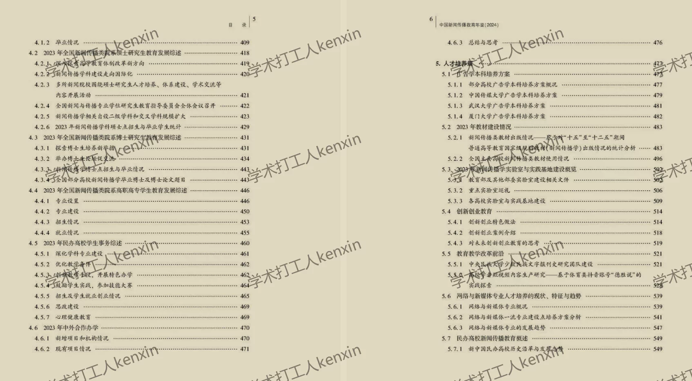
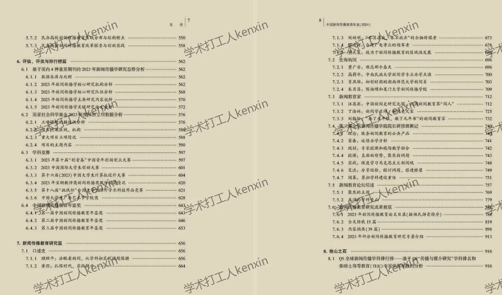
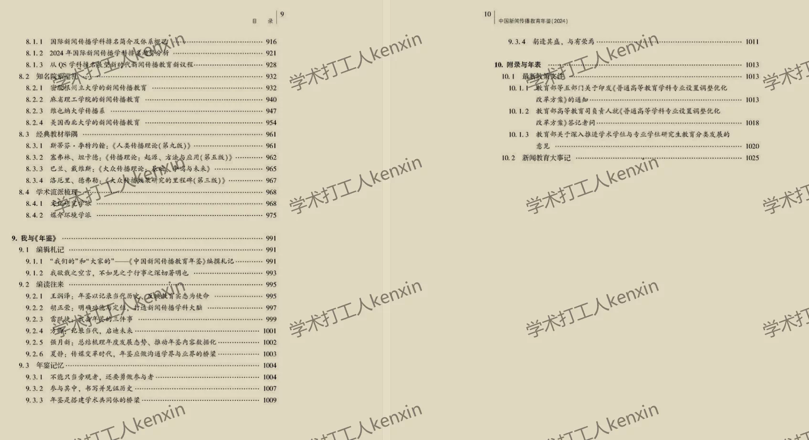

## Body

《中国新闻传播教育年鉴》（2016-2025年）

Data Introduction:
The "China Journalism and Communication Education Yearbook" (2016-2025)

Indicator Details:
(1) The directory is displayed in the image, please take a look on your own. Please purchase according to your needs. If you need help finding data, we are not responsible for it. We do not support returns or exchanges after shipping.
(2) The display directory is for 2024, due to space limitations, only some of the entries are shown. The statistical methods may change from year to year. For academic knowledge, please be informed.
(3) The Excel format data is compiled from original materials, including the content of the original data but not the textual content of the original materials.
(4) If the data is placed in a zip file, you need to save the zip file first, then download and unzip it.
(5) If there is Excel protection, you can select all and copy to a new sheet to use.

Data Format:
All in PDF

## Images

item_1068828379827

Here is a pay link on Stripe ( https://buy.stripe.com/3cs8yP7sY87d0vu9AB ). Please contact me lonlonago@foxmail.com after funding $89, and I will send you a complete data files , thank you!

